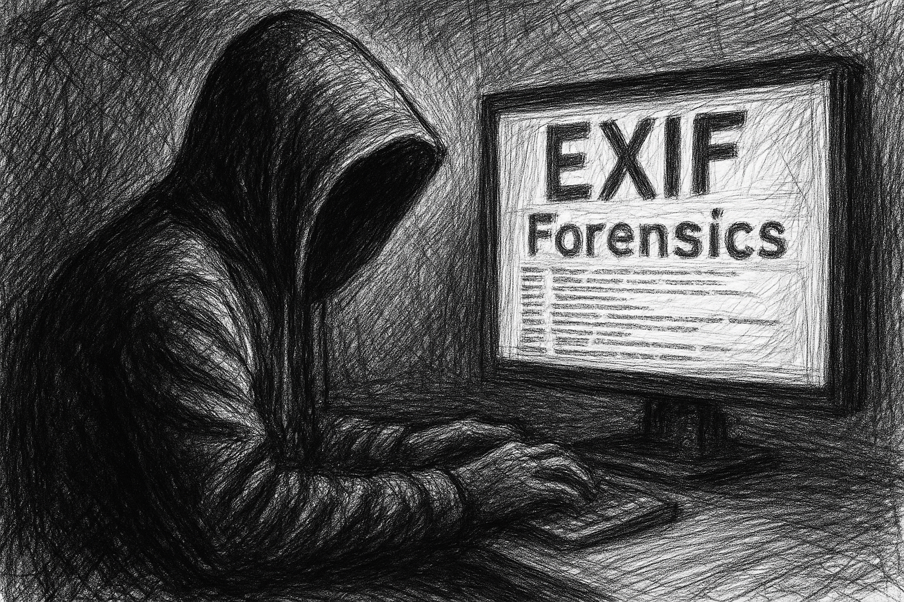

# 📷 ExifPhotoForensics

**ابزار تحلیل و پاک‌سازی متادیتا (EXIF) تصاویر — مناسب برای تحلیل‌گران امنیت، OSINT، عکاسان و توسعه‌دهندگان وب**

---



## 🎯 معرفی

ExifPhotoForensics یک ابزار قدرتمند و سبک برای مشاهده، تحلیل، و حذف داده‌های EXIF از تصاویر دیجیتال است. این داده‌ها می‌توانند شامل مکان (GPS)، زمان، مدل دوربین، نرم‌افزار، و اطلاعات دیگر باشند که گاهی اوقات باید برای حفظ حریم خصوصی یا تحلیل امنیتی بررسی یا حذف شوند.

---

## 🎬 پیش‌نمایش ویدئویی

برای آشنایی کامل با نحوه استفاده از ابزار، ویدئوی آموزشی زیر را مشاهده کنید:

[](assets/Video.mp4)


---

## 🔍 ویژگی‌ها

- **تحلیل کامل داده‌های EXIF** عکس‌ها
- **حذف داده‌های حساس** مانند GPS، تاریخ، مدل دوربین
- **تشخیص تقلب یا تغییر در فایل‌های تصویری**
- **سازگاری با سیستم‌عامل‌های مختلف (با پایتون)**
- **رابط خط فرمان ساده و سریع**

---
## License

This project’s original code is licensed under the MIT License - see the [LICENSE](./LICENSE) file for details.

Parts of this project include code copied from [ExifTool](https://exiftool.org/), developed by Phil Harvey, which is licensed under the Artistic License 2.0.  
The full text of the Artistic License is included in the [ARTISTIC-LICENSE](./ARTISTIC-LICENSE) file.

---

## 📥 نصب

```bash
git clone https://github.com/TahaHatami/ExifPhotoForensics.git
cd ExifPhotoForensics


